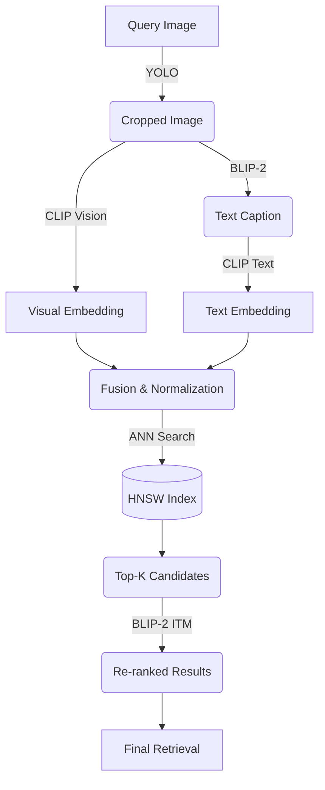

# Visual Product Search Engine

A query-by-image retrieval system for fashion products based on the DeepFashion In-Shop Clothes Retrieval dataset. Returns similar fashion items leveraging YOLO object detection, BLIP-2 captions, CLIP fusion embeddings, and an HNSW vector index. 

## Technical Architecture



## Setup & Installations

First, ensure you have Python 3.9+ and pip installed. We recommend setting up a virtual environment.

```bash
pip install -r requirements.txt
```

### Dataset Structure
The dataset relies on DeepFashion In-Shop Clothes Retrieval. Place the images and metadata inside the `data/raw` folder. Images should have identifiable paths containing `item_id`.

## Usage

### 1. Offline Indexing
Extracts objects, captions them, builds bindings, and constructs the HNSW index in `index/hnsw_index`.
```bash
python src/indexing.py --data_dir data/raw --index_path index/hnsw_index --alpha 0.5
```

### 2. Fine-Tuning CLIP
Fine-tune the vision encoder of CLIP with negative sampling.
```bash
python src/finetune.py --data_dir data/raw --output_dir models/clip_finetuned --epochs 5
```

### 3. Streamlit Interface
Test the end-to-end functionality interactively on a webpage!
```bash
streamlit run app.py
```

### 4. Running Benchmarks
Run a batch evaluation pipeline for Recall@K, NDCG@K, mAP@K across `K={5, 10, 15}`.

```bash
python evaluate.py \
    --query_dir data/raw/queries \
    --gallery_dir data/raw/gallery \
    --index_path index/hnsw_index \
    --model_path models/clip_finetuned \
    --alpha 0.6 \
    --output results.csv
```

## Ablation Study Results
| Configuration | Alpha (α) | Recall@5 | Recall@10 | NDCG@10 | mAP@10 |
| ------------- | --------- | -------- | --------- | ------- | ------ |
| A: Vision-only (Baseline) | 1.0 | - | - | - | - |
| B: Frozen CLIP + BLIP-2 | 0.5 | - | - | - | - |
| B: Frozen CLIP + BLIP-2 | 0.8 | - | - | - | - |
| C: Finetuned CLIP + BLIP-2 | 0.5 | - | - | - | - |
| C: Finetuned CLIP + BLIP-2 | 0.8 | - | - | - | - |
